Team Name: CodeCucumber
Team Members
Member 1: Hanna Fathima - Model Engineering College
Member 2: Treesa Maria George - Model Engineering College

Hosted Project Link
https://surplus-saver-f0b75.web.app/

Project Description
Surplus Saver is a specialized protocol for food waste management that creates a direct, real-time connection between food vendors and shelters. By digitizing the recovery process, it ensures surplus meals are efficiently redirected to those in need instead of ending up in landfills.

The Problem statement
Despite massive food production, local vendors frequently discard high-quality surplus at the end of the day due to a lack of immediate, organized distribution. Meanwhile, local shelters struggle to secure consistent, nutritious meals. Current manual donation processes are too slow for perishable goods, leading to preventable waste and localized food insecurity.

The Solution
Real-Time Vendor Dashboard: Restaurants and bakeries can list "Expiring Soon" inventory in under 30 seconds. This creates immediate visibility for items that would otherwise be trashed at closing time.

Direct Shelter Alerts: Registered shelters receive instant notifications based on their location. This bypasses the "information silo" and ensures food is claimed while still fresh and safe.

Verified Chain of Custody: The protocol tracks the food from the moment a vendor posts it to the moment a shelter accepts it, ensuring accountability and safety.

---------------------------------------------------------------------------------------------------------------------------------------------------

Technologies & Components:
--------------------------

Languages used: JavaScript (ES6+), HTML5, CSS3

Frameworks used: React.js (Frontend), Tailwind CSS (Styling)

Libraries used: * firebase: For database and auth integration.

react-router-dom: For navigating between the Vendor Dashboard and Shelter view.

lucide-react: For clean, modern UI icons.

date-fns: To calculate food expiration countdowns.

Tools used: * VS Code: Primary code editor.

Git & GitHub: Version control and collaboration.

GitHub Actions: CI/CD pipeline for automated deployments.

Firebase Console: For managing the NoSQL Firestore database.

NPM: Package management.

---------------------------------------------------------------------------------------------------------------------------------------------------

Key Features:
-------------

Feature 1: Real-Time Surplus Dashboard (Vendor Side)
A streamlined interface allowing restaurants and bakeries to list surplus items in under 30 seconds. It uses Firestore WebSockets to broadcast new food availability to all nearby shelters instantly, ensuring no time is lost for perishables.

Feature 2: Instant Shelter Alerts & Claiming System
A specialized "First-Come, First-Served" protocol where registered shelters receive push notifications for local donations. Once a shelter "Claims" a listing, it is hidden from others to prevent double-pickup confusion and wasted trips.

Feature 3: Dynamic Expiry & Priority Logic
The system automatically categorizes food by shelf-life (e.g., "Cooked Meals" vs. "Dry Goods"). 

Feature 4: Verified "Chain of Custody" Tracking
A secure verification loop that tracks the food from vendor post to shelter pickup.

---------------------------------------------------------------------------------------------------------------------------------------------------

Installation:
-------------

Before running the commands, ensure you have Node.js installed on your system.

Clone the Repository:

Bash
git clone https://github.com/Treesa24/surpluss.git
cd surpluss
Install Dependencies:
This command reads your package.json and downloads all necessary libraries (React, Firebase, Tailwind, etc.) into the node_modules folder.

Bash:
npm install
Install Firebase Tools (Optional but Recommended):
If you need to manage hosting or database rules from your terminal:

Bash:
npm install -g firebase-tools
🚀 Run
Once the installation is complete, you can launch the app locally to test your changes.

Start the Development Server
Bash:
npm start
This will open the app in your browser at http://localhost:3000.

Build for Production:
If you want to see how the app performs in a "live" state before deploying:

Bash:
npm run build

---------------------------------------------------------------------------------------------------------------------------------------------------

Project Documentation:
----------------------
Screenshot1:
Screenshot2: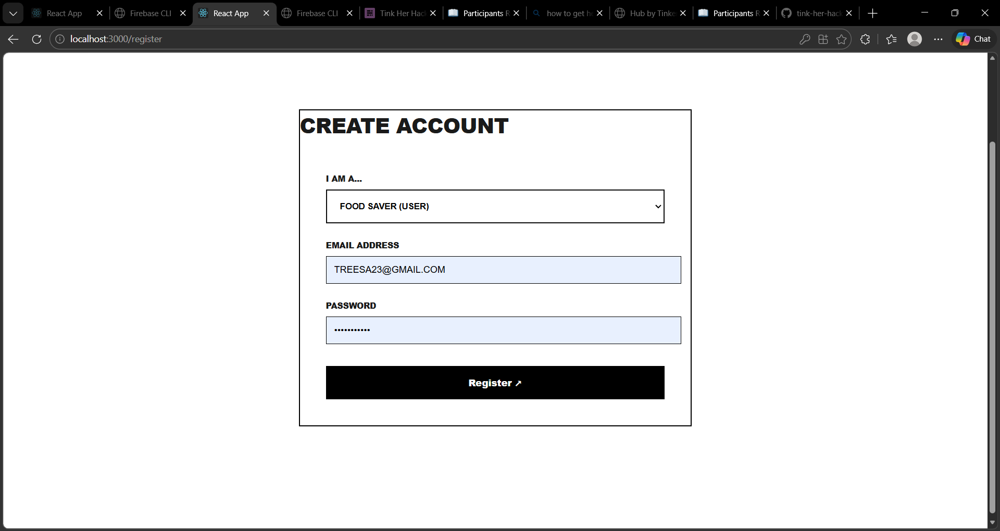
Screenshot3: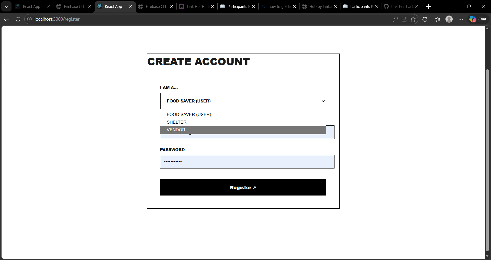
Screenshot4: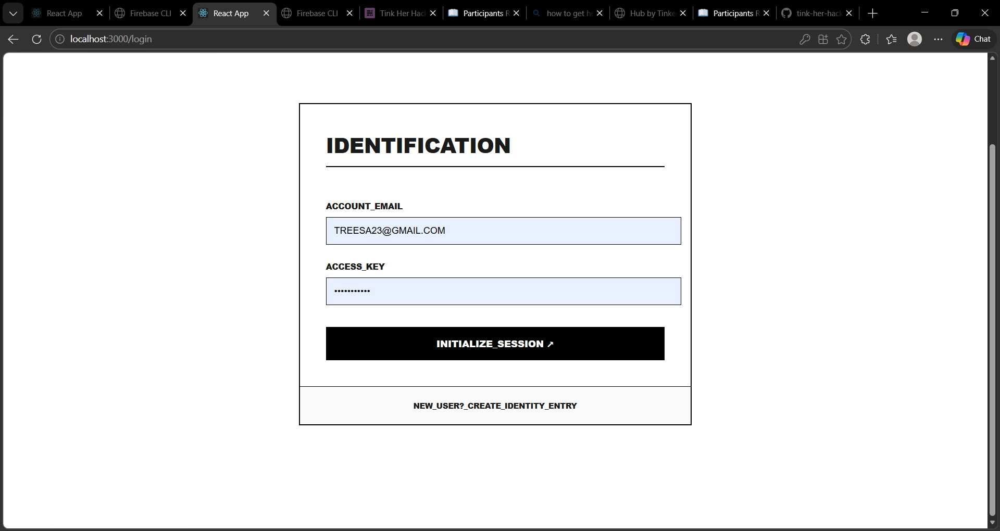
Screenshot5: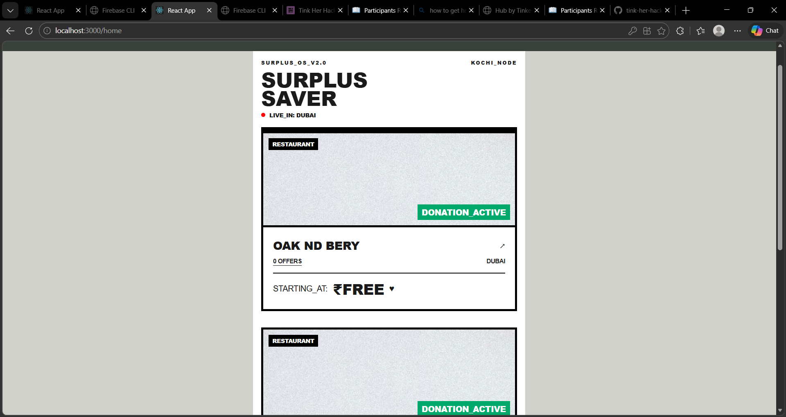
Screenshot6: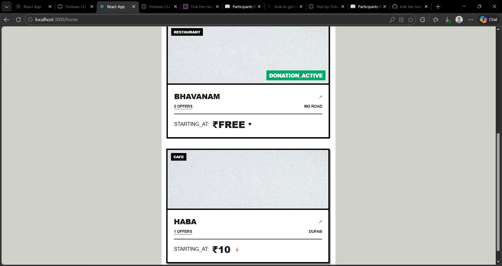
Screenshot7: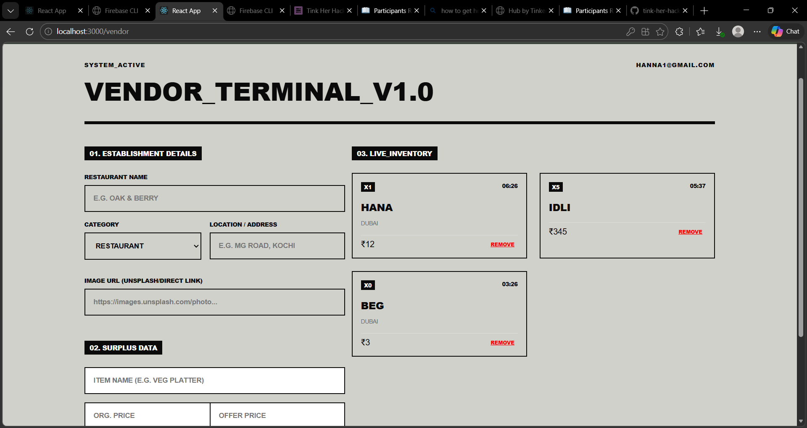
Screenshot8: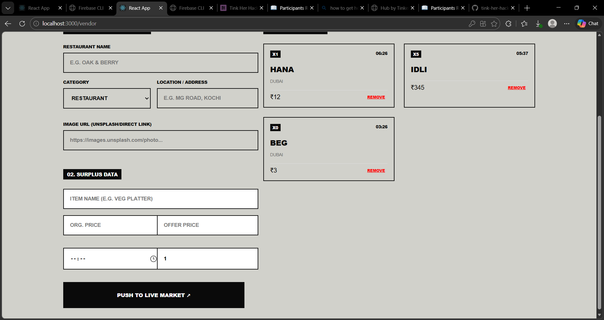
Screenshot9: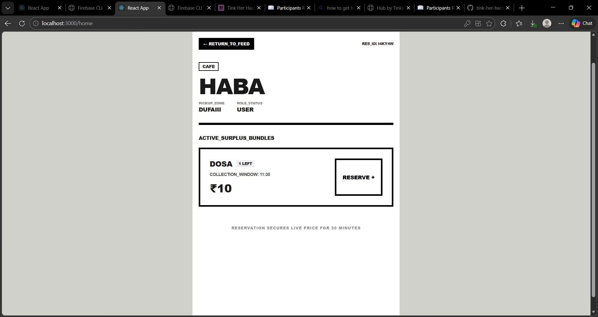
Screenshot10: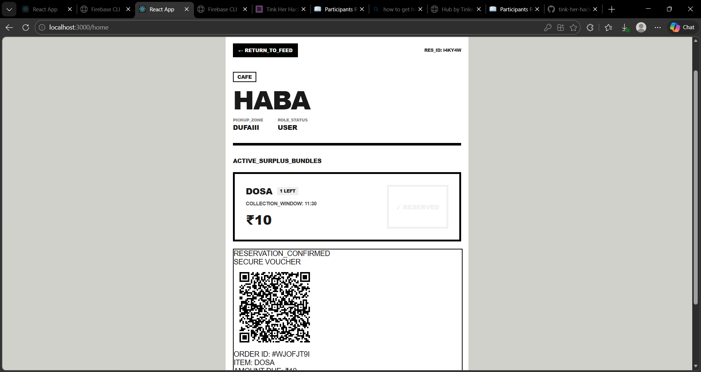
Screenshot11: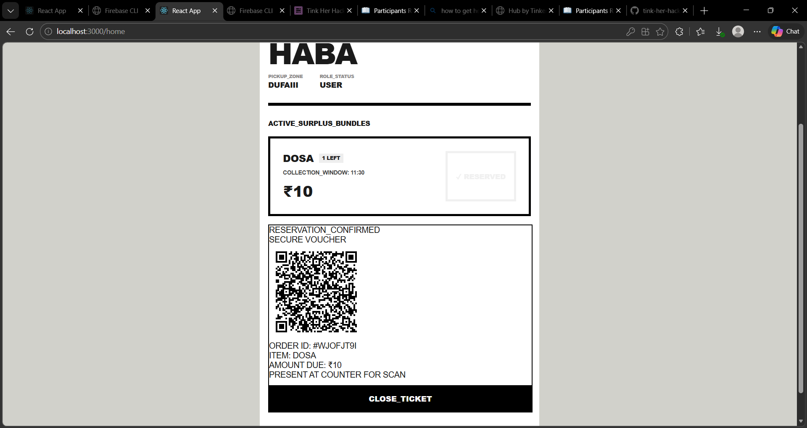
Screenshot12: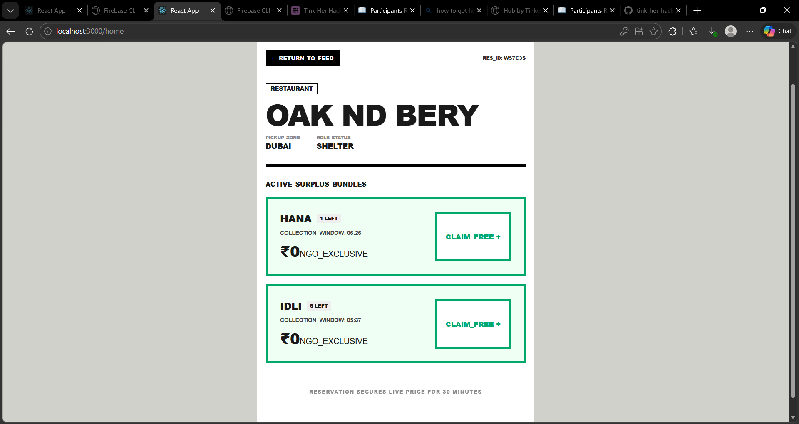
Screenshot13: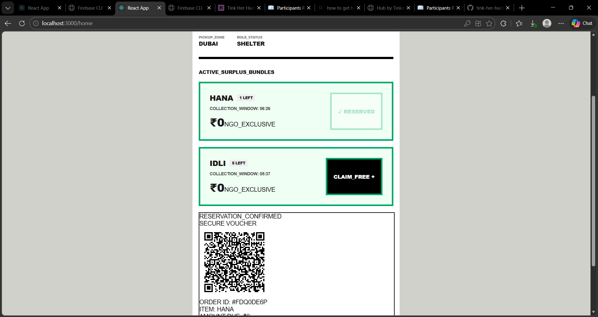
Screenshot14: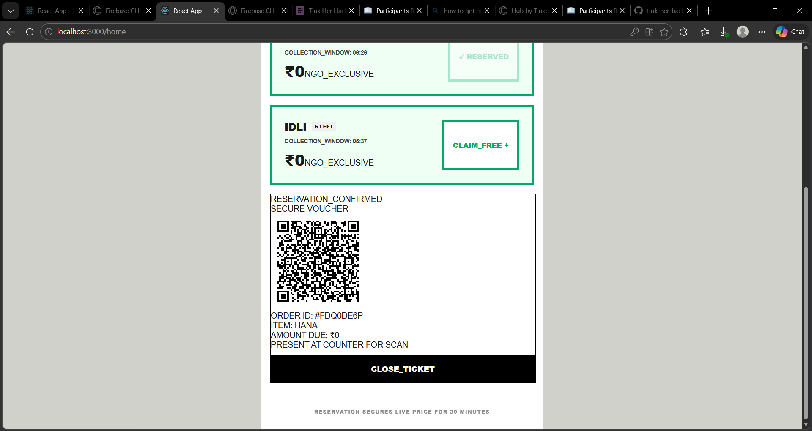

---------------------------------------------------------------------------------------------------------------------------------------------------

Diagrams:
---------

System Architecture: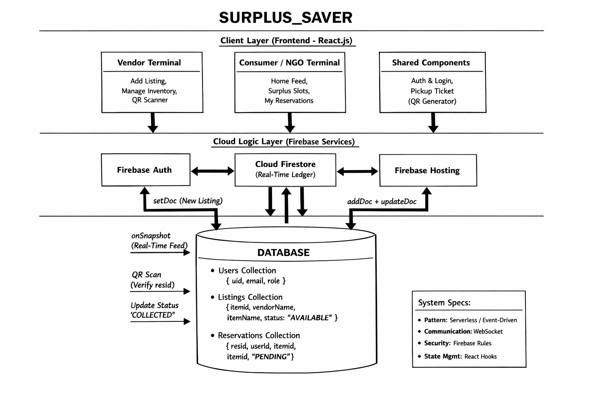

Application Workflow:
The workflow is designed as a Request-Response-Verify loop. Below is the step-by-step captioning for how the data moves through the architecture:

I. Initialization (Vendor Side)
The Action: A Vendor logs into the Terminal UI .

The Data Flow: The React state captures the item details and pushes a JSON object to the listings collection in Firestore.

System Status: The item is now "Live." Because of Firebase’s WebSockets, this update is pushed to every connected client in milliseconds without a page refresh.

II. The Discovery (Consumer/NGO Side)
The Action: The Consumer sees the item on their Home Feed .

The Data Flow: Clicking "Claim" triggers a Firestore Transaction.

The Logic: The system checks if the item is still available. If yes, it creates a new reservation document and marks the original listing as RESERVED. This prevents two people from claiming the same bagel at the same time.

III. The Secure Handshake (The Bridge)
The Action: The Consumer’s app generates a Dynamic QR Code based on the reservation_ID.

The Data Flow: This is a purely frontend operation. No data is "sent" yet; the phone just encodes the database ID into a scannable image.

IV. Verification & Closing (The Hand-off)
The Action: The Vendor scans the Consumer's phone using the integrated Camera Scanner.

The Data Flow: The Vendor's device sends the scanned ID back to Firestore.

Finalization: The database verifies the ID exists and belongs to that vendor. If valid, the status flips to COLLECTED. This clears the ledger and completes the "Rescue."

---------------------------------------------------------------------------------------------------------------------------------------------------

Additional Documentation:
-------------------------

System Protocol Documentation

Base Connection: `firebase.firestore()`

Real-time Protocol: `onSnapshot()`

1. LISTINGS_LEDGER (The Inventory)

`GET` Equivalent: `db.collection("listings").where("status", "==", "AVAILABLE")`

Description: Fetches all live surplus food items currently available for rescue.
Parameters:
 `status` (string): Filtering for available inventory.
 `vendorId` (string): (Optional) Filter by specific restaurant.


Response Structure:

```json
{
  "id": "item_8829",
  "vendorName": "ODIN_BAKERY",
  "itemName": "SOURDOUGH_BATCH_04",
  "price": 45,
  "quantity": 3,
  "timestamp": "2026-02-28T07:44:00Z"
}

```

---

 2. INITIALIZE_RESERVATION (The Claim)

`POST` Equivalent:** `db.collection("reservations").add()`

Description: Converts a listing into a pending rescue mission.
Request Body:

```json
{
  "itemId": "item_8829",
  "userId": "user_4421",
  "status": "PENDING",
  "expiry": "60m"
}

```

System Action: Triggers a `transaction` to decrement the listing quantity and generate the QR-encoded `resId`.

---

 3. VERIFY_HANDSHAKE (The Scanner)

`PATCH` Equivalent: `db.collection("reservations").doc(resId).update()`

Description: The Vendor scans the QR code to finalize the food handover.
Parameters:
 `resId` (string): The ID decoded from the Consumer's QR code.


Response:

```json
{
  "status": "success",
  "message": "IDENTITY_VERIFIED_COLLECTION_COMPLETE",
  "updatedAt": "2026-02-28T08:15:00Z"
}

```
---------------------------------------------------------------------------------------------------------------------------------------------------

Project Demo:
-------------
Video:https://youtu.be/FhbBHaOPfUA

---------------------------------------------------------------------------------------------------------------------------------------------------

AI Tools Used:
--------------

Tool Used: gemini , vscode copilot

Purpose: 
Code review and optimization suggestions 

Key Prompts Used:
"make a simple border ... explain step wise what all changes have to be made and in which all files"
"import './Loading.css'; [Loading Component Code] ... make it a Minimalist Brutalist theme."
Percentage of AI-generated code: [Approximately 72%]

Human Contributions:

Architecture design and planning
Custom business logic implementation
Integration and testing
UI/UX design decisions

---------------------------------------------------------------------------------------------------------------------------------------------------

Team Contributions
Treesa Maria George: Frontend Development, Database configuration
Hanna Fathima: Implement additional features

---------------------------------------------------------------------------------------------------------------------------------------------------

Licencse:
---------

MIT License: (Permissive, widely used) — Allows anyone to do almost anything with your code as long as they provide attribution and don't hold you liable.